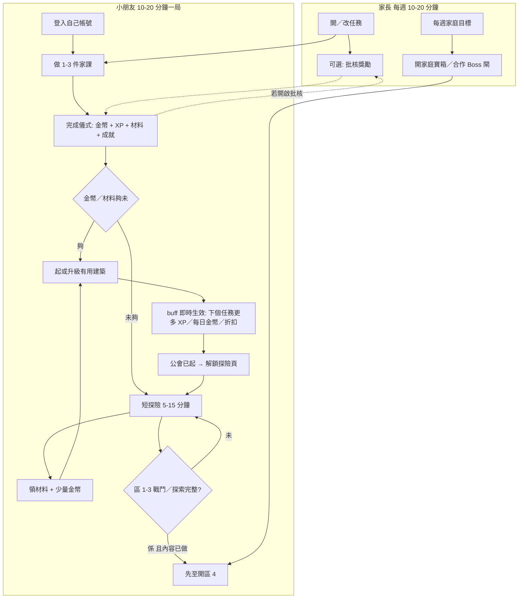

# Kids Town 遊戲循環重新設計 企劃

> **性質**：產品企劃，**未實作**。跟住呢份文件先寫測試、再寫碼。  
> **軌道**：Track B（漸進重構）；**Phase 0 安全閘必須先過**，先至可以公網／ngrok 示範。  
> **對齊**：[`docs/EVALUATION.md`](EVALUATION.md)（PR #1）。若本企劃同評估衝突，**優先較安全、對細路友善嘅節奏，同誠實 buff**。  
> **日期**：2026-09-18  
> **識別名**（路由、欄位、`buff_type`、材料 id）保留英文。

---

## 0. 一句話

唔重寫遊戲。接回 `DEV_PLAN.md` 承諾過、但程式未兌現嘅主循環：**做家課 → 見到獎勵 → 用金幣／材料起有用嘅屋 → 短探險農材料 → 再開下一區**。對外示範之前，安全止血（Phase 0）係硬閘。

---

## 1. Goals 同 non-goals

### 1.1 Goals（要達成）

| ID | 目標 | 點樣算做到 |
|----|------|------------|
| G1 | **循環誠實** | 圖書館／農場／商店嘅文案，完成任務或買嘢時真係生效；唔再只係裝飾 + 戰鬥技能 |
| G2 | **獎勵看得見** | 完成任務 5 秒內見到金幣、XP、材料、（如有）成就，唔使翻背包先知 |
| G3 | **材料同一套語言** | 探險／戰鬥／任務掉落、商店成本、HUD 四格，用同一組 `item_type` |
| G4 | **3 區完整先開 4–5** | 森林／雪山／沙漠：探索、學科、戰鬥、Boss 敘事都走得通；火山／星輝未做完就明確鎖定，唔好 404 |
| G5 | **15 分鐘入局** | 新家庭跟 §8 劇本，15 分鐘內完成「第一個任務 + 第一座有用建築 + 一次短探險」 |
| G6 | **兒童節奏** | 預設探險以分鐘計，唔係 8–12 小時真等；長征係可選、後期 |
| G7 | **家長可控、唔攔截快樂** | 可選「完成後家長批核先發獎」；預設關閉，唔阻住而家屋企用緊嘅即時金幣 |

### 1.2 Non-goals（今輪明確唔做）

- **唔做綠地重寫**（Track C）：唔換 Flask／SQLite／`index.html` DOM 城、唔重畫戰鬥公式。
- **唔做訂閱／付費區／pity 變現**。`MONETIZATION_STRATEGY.md` 繼續雪藏到 Phase 0 + tenant 穩。
- **唔做 App Store / COPPA 審計產品**。Phase 0 只達「唔好把兒童資料同寫入 API 暴露去公網」。
- **唔恢復 Canvas 城鎮**做生產前端；生產維持 DOM 格。`index-legacy.html` 當資產，唔當入口。
- **唔加第 6 區、主題包、推送通知、自訂頭像大改**。
- **唔在呢個 PR 改 runtime**。實作必須另開 follow-up PR，而且測試先行（見 `TDD_PROCESS.md`）。
- **唔把已提交 `kids_town.db` 當設計真相**。以 `seed_building_defs()` 嘅 10 座為準；銀行（id=11）列入 Later。

---

## 2. 目標玩家同成功指標

### 2.1 兩個玩家，一條產品

| 角色 | 畫像 | 每次想完成咩 | 痛點（而家） |
|------|------|--------------|--------------|
| **家長** | 香港家庭、1–2 個 6–12 歲小孩；每週花 10–20 分鐘設任務 | 開任務、睇邊個做咗、必要時加減分；唔想被細路改分／睇到其他家庭 | 管理頁有時空白；API 無認可；細路知前端 `PARENT_PASSWORD='1234'` 可進管理 |
| **小朋友** | 識用平板／手機瀏覽器；一次玩 **10–20 分鐘** | 做家課 → 聽到／見到獎勵 → 起屋或打一場 → 收工 | 起屋唔改變任務；探險按鈕寫 🪙30 但其實唔扣錢；區 4–5 戰鬥 404；獎勵只 toast 金幣 |

### 2.2 成功指標（可量度、跟住測試）

**產品／家庭（手動或日誌，Phase 2 先儀表化）：**

| 指標 | 目標 | 點計 |
|------|------|------|
| 新號 15 分鐘完成率 | ≥ 80% 跟劇本嘅測試員做到 G5 | 對住 §8 清單打勾 |
| 第一座「有用建築」 | 圖書館或農場，唔係只放裝飾 | `buildings` 有 `def_id` 1 或 3 |
| 短探險完成 | 同一次 session 內 start + claim | `expeditions.status='completed'` 且 duration ≤ 15 min |
| 家長信任 | 示範前 Phase 0 測試全綠 | `docs/test-cases/PHASE0_SECURITY.md` P0 全過 |

**工程（每個相關 PR 硬指標）：**

| 指標 | 目標 |
|------|------|
| 相關 pytest | 全綠；新功能無測試唔合併 |
| 雙重驗證 | (A) 自動化 + (B) 本 PR 手動／E2E checklist 簽收 |
| 公開示範 | Phase 0 未綠 → **禁止** ngrok／`0.0.0.0` 轉發 |

**明確唔用嚟衡量成功：** DAU、留存漏斗、付費轉化、5 區全通關率（區 4–5 未開放）。

---

## 3. 而家循環有咩問題（精簡引用評估）

來源：[`docs/EVALUATION.md`](EVALUATION.md) §1、§2 P1-2～P1-8。設計圖來自 `DEV_PLAN.md`。

```
設計承諾：任務 → 金幣+XP → 扣金幣探險 → 材料 → 起屋 → buff 令任務／探險更值 → 解鎖新區
實作現況：任務 → 只 toast 金幣（XP／材料／成就被藏）→ 探險唔扣金幣、探索一次就不能再農
           → 材料 id 分裂（iron/gem vs gear/glass）→ 起屋幾乎無 buff → 區 4–5 戰鬥 404
```

| 斷點 | 評估證據 | 對細路嘅感覺 |
|------|----------|--------------|
| 建築 buff 未接線 | `buff_type` 只被 SELECT，任務／探險唔讀 | 「圖書館寫住 +2⭐，做完任務都係咁」 |
| 探險唔扣金幣；UI 🪙30/60/… 似費用其實係預計獎勵 | `start_expedition` 無扣 `kids.points` | 誤導；金幣無 sink，起屋前一堆錢但唔知點用 |
| 探索完成後該區難再農 | claim 後當「已完成」 | 材料改靠任務隨機同戰鬥 |
| 5 區地圖、3 隻怪 | `battle_start` 無 monster row → 404 | 後期按鈕係陷阱 |
| 材料兩套語言 | claim 掉 `iron`/`gem`；HUD／商店要 `gear`/`glass` | 「農咗鐵但商店要齒輪」 |
| 任務完成反饋只顯示金幣 | `completeTask()` 忽略 `experience_gained`／`material_drops`／`achievements` | 隱藏獎勵 = 無獎勵 |
| 公會 600 金 + 2–12 小時 | 前端先檢查 `def_id===6`；後端探險**唔**檢查 | 新號入唔到主循環；改 API 可跳過 |
| `unlock_region` 未執行 | `place_building()` 無讀該欄 | 燈塔／競技場／天文台可提早起，文案講緊要探險 |
| XP 條公式錯 | HUD `(level*100)` vs 後端 `EXP_PER_LEVEL=25` 三角 | 條會長期滿或長期空 |
| 安全（Phase 0 範圍） | 無 session、IDOR、預設 admin、明文 PIN、靜態可下載 `.db`/`.py` | 唔可以公開示範 |

**本企劃對評估嘅取捨（寧可慢、寧可誠實）：**

- **唔**為咗「地圖上有 5 個掣」而草率 seed 區 4–5 怪；未完成內容就 **鎖定 + 明確錯誤**。
- **唔**保留 8h／12h 做預設探險；改短征。
- **唔**把 buff 改成「只改文案」；Phase 1 必須令 2–3 個 buff 可測、可見。
- **保留** 後端 `EXP_PER_LEVEL=25` 溫和曲線（細路升級密啲）；**改前端同註解**，唔好把門檻抬去 100 去遷就錯 HUD。

---

## 4. 重新設計嘅核心循環

### 4.1 玩家看見嘅循環



ASCII 版（Mermaid 唔顯示時用）：

```
家長開任務 ─────────────────────────────────────────┐
                                                    ▼
小朋友登入 → 做家課 →【完成儀式：🪙 XP 📦 🏆】
                │                │
                │                ├─(可選) 等家長批核先入帳
                ▼                ▼
         金幣／材料 ──起圖書館／農場／商店── buff 下一轉生效
                │
                ▼
         起探險公會（伺服器檢查）→ 短探險（扣小額金幣，5–15 分鐘）
                │
                ▼
         再農材料／打區 1–3 → 家庭每週目標 →（內容齊）先開區 4–5
```

### 4.2 伺服器權威規則（前端只係皮膚）

| 規則 | 權威位置 | 前端只負責 |
|------|----------|------------|
| 任務發獎、buff 計算、批核狀態 | `complete_task` + 新 helper | 顯示儀式、唔自己加分 |
| 材料 id、數量增減 | inventory API + 掉落表 | HUD 按 canonical id 顯示 |
| 探險扣金幣、時長、可否重複農 | `expedition/start` + `claim` | 標示「費用」vs「預計獎勵」 |
| 公會閘、區域鎖、`unlock_region` | 各 POST handler | 禁用按鈕 + 複製伺服器錯誤字 |
| 戰鬥有怪定鎖定 | `battle_start` | 區 4–5 顯示「尚未開放」，唔好當 404 當「壞咗」 |

---

## 5. Phase 地圖（跟評估建議）

實作順序 **唔可变**：0 → 1 → 2。Phase 1 遊戲 PR 若 Phase 0 測試未綠，唔合併到會公開部署嘅分支。

### Phase 0 — 安全閘（公開示範前必須）

對應評估 P0-1～P0-8、P1-14～P1-16。測試目錄：`docs/test-cases/PHASE0_SECURITY.md`。

| 必做 | 完成定義（摘要） |
|------|------------------|
| 寫入 API 要 session | 無 cookie／token → 401；角色不符 → 403 |
| IDOR | 小朋友 A 唔可以改 B 嘅分、背包、任務、建築 |
| 預設 admin | 空庫**唔**再插入 `admin`/`admin123`；若舊庫仍有，強制改密先用 |
| PIN | 只存 hash；login JSON **唔**回傳 PIN；唔再缺 record 就插入 `0000` |
| 靜態白名單 | `/kids/*.db`、`*.py`、`*.pyc`、repo 源碼 → 404；path normalize |
| 家長密碼 | salted hash（bcrypt 或等價）；最短 8；唔接受 SHA-256 無 salt 做新密碼 |
| `inventory/add` | 非授權呼叫 403；生產路徑小朋友唔可以自己加材料 |
| 金幣唔可以經未授權路徑變負 | `add_points` 負數要家長；一律 floor 0 |
| `GET /api/kids` | 唔再公開全站名單 |
| XSS | 任務標題／名用 text 編碼策略（見測試） |
| 測試 DB | **禁止** copy 生產 `kids_town.db`；空庫 + seed |

**Phase 0 唔做玩法平衡**（除咗擋公開寫入）。止血期間可以暫時關 `inventory/add`、`/api/dev-dashboard`。

### Phase 1 — 循環誠實（buff、材料、區域、任務反饋）

測試目錄：`docs/test-cases/PHASE1_GAMEPLAY.md`。

| 必做 | 完成定義 |
|------|----------|
| 2–3 個建築 buff | §6.1 圖書館、農場、商店 — 有 pytest |
| 統一材料 | §6.2 canonical 表；舊 id 寫入時正規化 |
| 區 4–5 | 戰鬥：**有怪**或 **明確 `region_locked`**；本企劃揀後者直到內容齊 |
| `unlock_region` | 燈塔要已探索 r3（region_id=3），如此類推 |
| 任務完成儀式 | API 欄位齊 + 前端顯示策略（§6.4） |
| XP 條 | 用 `experience_in_level` / `experience_for_next` helper |
| 探險金幣政策 | §6.5：短征扣小額費用；UI 分開費用同獎勵 |
| 公會閘 | 後端強制有未存倉嘅探險公會 |
| 放置模式 | 商店同建築分頁都進入 `startPlacement`（前端；見測試註） |

### Phase 2 — UX 節奏（新手、短征、家庭目標）

| 必做 | 完成定義 |
|------|----------|
| 15 分鐘劇本可自動／半自動跑 | §8；新家庭 seed 起始任務 + 足夠買圖書館或減價公會 |
| 短征 vs 長征 | 預設短；長征（≥2h）要明確選擇，唔係唯一按鈕 |
| 可選家長批核 | §6.7；family setting，預設 off |
| 家庭每週目標／合作 Boss 閘 | §6.8 最小版 |
| 家長登入 hydrate 管理頁 | 評估 P1-12：`st('manage')` 要 `renderManage()` |

Phase 2 仍然 **唔** 加付費區。

---

## 6. 具體玩法提案 + 驗收標準

### 6.1 第一批建築 buff（2–3 個：圖書館、農場、商店）

**點解就呢三個：** 評估 Track A 點名圖書館 + 農場；第三個用商店折扣，因為起屋係主 sink，小朋友即刻見到「平咗」。公會係**閘**唔係數值 buff，放 §6.8 旁邊、§6.6。競技場 `expedition_gold`、醫院、工坊、燈塔、天文台、健身室 → Phase 1.5／Phase 2 先接，避免一次改晒經濟。

沿用 seed `buff_vals`（唔改數字，除非 Open Q 改公會成本）：

| 建築 | `def_id`（空庫 seed 順序） | `buff_type` | Lv.1→5 |
|------|---------------------------|-------------|--------|
| 📚 圖書館 | 1 | `task_bonus` | +2, +4, +6, +10, +15 **XP**（唔加金幣，避免同任務 `points` 雙重膨脹） |
| 🌾 農場 | 3 | `daily_gold` | +5, +10, +15, +25, +40 🪙／每個家庭本地日一次 |
| 🏪 商店 | 4 | `discount` | 金幣價 ×0.9, 0.85, 0.8, 0.75, 0.7（**材料數量不打折**） |

**套用規則：**

1. 只計該小朋友、`stored=0` 嘅建築；每類型最多 1 座（現有規則）。
2. 等級 `level`（1–5）對 `buff_vals[level-1]`。
3. Helper（建議名）`get_building_buff(kid_id, buff_type, db) -> value | None`，任務／購買／每日領取**只經呢個函數**，方便單測。
4. 圖書館：`complete_task` 喺 `award_task_drops` 嘅基礎 XP `max(5, points//2)` **之上再加** `task_bonus`。儀式要分開顯示 `experience_gained` 同 `experience_bonus`。
5. 農場：新 `POST /api/kids/<id>/farm/claim`。同一 `Asia/Hong_Kong` 日第二次 → 400 `already_claimed_today`。未起農場 → 400 `farm_required`。成功寫 `points_log` reason=`daily_gold`。
6. 商店：`place_building` 同 `upgrade` 嘅**金幣**成本 `floor(cost * discount)`，最少 1 金幣；`points_log` 記實際扣除。

**驗收：**

- [ ] 無圖書館：任務 XP = 基礎值；有 Lv.1 圖書館：基礎 + 2；升級後用新值。
- [ ] 農場未領／已領／跨日 三態有測試。
- [ ] 商店 Lv.1 買圖書館：100×0.9=90 金幣（若同時有圖書館折扣——只對**之後**嘅購買；自己起商店嗰下未有折扣）。
- [ ] HUD／建築卡顯示「而家生效：任務 +2 XP」，數字同 API 一致。
- [ ] 存倉（`stored=1`）建築唔出 buff。

### 6.2 統一材料

**Canonical 五種（HUD 四格 + 一格稀有）：**

| `item_type` | 顯示名 | 圖示 | HUD | 用途 |
|-------------|--------|------|-----|------|
| `wood` | 木材 | 🪵 | 有 | 低階建築 |
| `brick` | 磚頭 | 🧱 | 有 | 中階建築 |
| `glass` | 玻璃 | 🪟 | 有 | 中高階（原 gem／star_shard 喺 **建築成本** 嘅位置） |
| `gear` | 齒輪 | ⚙️ | 有 | 工坊／公會等（原 `iron`） |
| `gem` | 寶石 | 💎 | 背包＋Boss 入口 | **只做稀有 sink**（召喚 Boss）；**唔**再同 glass 合併，以免 Boss 同裝修搶同一物 |

**寫入正規化（伺服器，所有 add/claim/drop）：**

| 舊 id | 寫入變成 |
|-------|----------|
| `iron` | `gear` |
| `star_shard` | `glass`（建築成本語意，同現有 `migrate_db` 一致） |
| `star_fragment` | `gem` |
| `star_stone` | `gem` |
| `dragon_scale` | **保留**做特殊事件物（唔入商店配方）；背包可見 |
| `fur` | **保留**做戰鬥風味物；HUD 唔佔四格；商店唔消耗 |
| `mystery_box` | Phase 1 **停發**（評估話偏 gacha；兒童友善）。舊存檔可留喺背包但無開箱 |

`GET /api/materials/defs` 必須返回至少 HUD 四種 + `gem`。`MATERIAL_POOLS`、`claim_expedition` 掉落表、戰鬥 `mat_reward`、`seed` 怪物 JSON，全部只產出 canonical（加可選 `dragon_scale`／`fur`）。

**遷移：** 一次性把 inventory 舊 id 合併數量到新 id，然後刪舊行。公會 `materials='{}'` 嘅壞 save：seed 修復回 wood/brick/gear，**唔**維持零材料。

**驗收：**

- [ ] 探險 claim 回應同 DB **冇** `iron` 鍵。
- [ ] 商店 `building_defs.materials` JSON 鍵 ⊆ canonical。
- [ ] HUD 四格數量 = inventory 對應四 id。
- [ ] Boss 召喚仍耗 `gem`×1，唔係 glass。

### 6.3 三個完整區域，先至開 4–5

| Region | 名 | Phase 1 狀態 | 探索 | 戰鬥 | Boss |
|--------|----|--------------|------|------|------|
| 1 | 靜謐森林 | **完整** | 短征可重複農 | 要有怪（而家野狼） | 程序化 OK |
| 2 | 雪山山脈 | **完整** | 要先完成過區 1 至少 1 次探索或戰鬥勝 | 白熊 | 要區 1 first_kill（維持現有思路） |
| 3 | 沙漠遺跡 | **完整** | 鏈式解鎖 | 巨蠍 | 同上 |
| 4 | 火山谷 | **鎖定** | 按鈕可見但 disabled | `battle_start` → **400** `{"error":"region_locked","region_id":4}`，**禁止 404** | 同樣 locked |
| 5 | 星輝高原 | **鎖定** | 同上 | 同上 | 同上 |

「完整」= 該區：`monsters` 有 row、有圖（`MONSTER_ART`）、探索可 claim、失敗／每日限有人話、唔崩潰。**唔**要求三區數值已經完美平衡。

解鎖區 4 嘅**內容條件**（Phase 1 只寫閘，唔做內容）：小朋友已於區 3 戰鬥勝利 ≥1 **且** 產品已 seed 區 4 怪 + 圖。未 seed 就永遠 `region_locked`（比「有掣但 404」誠實）。

**驗收：**

- [ ] 區 1–3 `battle-start` 200 或業務 400（等級／每日），**唔係** `No monster for this region`。
- [ ] 區 4–5 固定 `region_locked`（或未來有怪時先改測試）。
- [ ] 前端複製 `error` 字串：「🌋 火山谷尚未開放」，唔顯示空白／技術 404。

### 6.4 任務完成儀式

**後端 `POST /api/tasks/<id>/complete` JSON 必備欄位：**

```json
{
  "points_awarded": 10,
  "experience_gained": 5,
  "experience_bonus": 2,
  "experience_total": 7,
  "material_drops": ["wood", "brick"],
  "achievements": [{"badge": "first_task", "title": "...", "icon": "🌟"}],
  "pending_approval": false,
  "kid": { "points": 0, "level": 1, "experience": 0, "experience_in_level": 0, "experience_for_next": 25 }
}
```

- `experience_gained` = 基礎（`max(5, points//2)`）。
- `experience_bonus` = 圖書館 `task_bonus`（無則 0）。
- `experience_total` = 兩者之和（寫入 `kids.experience` 嘅量）。
- `pending_approval=true` 時：**唔加**金幣／XP／材料；`points_awarded` 等欄位仍預告會發幾多，方便 UI 寫「等家長確認」。
- **禁止**把 XP 寫入 `points_log`（評估 P1-9）。XP 用獨立欄或 `experience_log`；成就「累積金幣」只計真正金幣。

**前端策略（pytest 難測 DOM 時，用契約 + 手動／Playwright）：**

1. 優先讀以上欄位；缺欄位當 0／[]，**唔好**再只顯示金幣。
2. 儀式卡（全屏或 modal ≤ 4 秒可跳過）：金幣數字、XP +N（有 bonus 則顯示「圖書館 +N」）、材料圖示、新成就隊列（沿用評估提到嘅 Kairosoft 彈窗方向）。
3. `innerHTML` 插入標題／名 **禁止**；用 `textContent` 或已編碼 helper。
4. 前端測試（Phase 1 可行範圍）：對 `completeTask` 用 mock fetch 斷言 toast／modal 文字包含 XP 同材料；E2E 清單見雙重驗證。

**驗收：** 見 `P1-TC-CER-*`。

### 6.5 探險節奏同金幣政策（本企劃決定）

**問題：** 設計話扣金幣；實作唔扣；UI 把預計獎勵寫成 🪙30，細路當費用。8–12 小時真等唔適合 10 分鐘局。

**決定（Phase 1 實作短征；長征 Phase 2 開選項）：**

| 模式 | 時長 | 金幣**費用**（start 時扣） | 預計獎勵（claim，可隨機） | 何時出現 |
|------|------|---------------------------|---------------------------|----------|
| **短征 explore** | **5 分鐘**（測試可傳 `duration_minutes=0` 或已有 `duration_hours=0` 即時 claim，**只准測試／debug flag**） | 區1 **10**；區2 **20**；區3 **30** | 區1 約 8–15；區2 15–25；區3 20–35（**期望值 ≤ 費用**，金幣靠任務；探險主產**材料**） | 預設、唯一對小朋友顯示嘅探索按鈕 |
| 戰鬥 | 即時 | **0** 金幣（每日每區 1 勝維持） | 現有戰鬥掉落 | 區 1–3 |
| 學科 quiz | 即時 | **0**（Phase 1 凍結題庫，唔擴） | 維持少量金幣 | 可留入口 |
| 長征 explore | 2 小時 | 區1 40；更遠之後先定 | 較多材料 | **Phase 2**；預設隱藏 |

**政策細節：**

1. `start` 金幣唔夠 → 400 `{"error":"insufficient_gold","need":10,"have":3}`，**唔建** expedition 行。
2. 扣費寫 `points_log` reason=`expedition_fee region={id}`，負數。
3. **探索可重複農**（推翻而家「已完成就 agr 唔到」）。`explored_regions` 只記「去過」用嚟解鎖下一區同 `unlock_region`，**唔**鎖死再出發。
4. 前端 REGIONS 表：刪「把 gold 當費用」嘅誤導。每區顯示兩行：`費用 🪙10`、`材料：木頭／磚…`。預計金幣獎勵細字或不顯示，避免以為探險係印鈔。
5. 短征 5 分鐘對真細路仍然長時，UI 要倒數；**唔**用 2–12h 做預設。`duration_hours` 舊欄：Phase 1 短征寫 `end_time = now + 5 minutes`。
6. 戰鬥／quiz 唔扣探險費（節奏已經即時）；公會閘仍然適用。

**驗收：** `P1-TC-EXP-*`。若之後想「探險賺淨金幣」，另開企劃，唔好喺 Phase 1 偷偷加大 `gold_reward`。

### 6.6 15 分鐘新玩家劇本

對象：家長 + 一個新小朋友，空庫 seed 後。假設 Phase 0 session 已存在。

| 分鐘 | 誰 | 動作 | 系統必須已經準備 |
|------|----|------|------------------|
| 0:00–1:00 | 家長 | 註冊／登入 → 建立仔女（username+PIN） | `create-kid` 要家長 session |
| 1:00–3:00 | 家長 | 建 3 條任務：🧹 收拾書包 10🪙、📖 閱讀 15 分鐘 15🪙、🦷 刷牙 10🪙 | 指定 `kid_id` |
| 3:00–4:00 | 小朋友 | PIN 登入，見到自己任務（唔見其他家庭） | 任務過濾 |
| 4:00–6:00 | 小朋友 | 完成「收拾書包」 | 儀式顯示 10🪙 + XP + ≥1 材料 |
| 6:00–10:00 | 小朋友 | 用金幣+木頭起 **圖書館**（100 金 + 5 wood）。若金幣不足：劇本要求家長任務總和 ≥ 100，或給 **一次性新手包** `wood×8, brick×5, points=120`（只新號、有 flag `starter_granted`） | 圖書館 buff 下一任務生效 |
| 10:00–12:00 | 小朋友 | 起 **探險公會**。成本見 Open Q#8；本企劃**暫定**降到 **150 金 + wood×10 + brick×5 + gear×0**，否則 15 分鐘劇本做唔完 | 後端公會閘 |
| 12:00–15:00 | 小朋友 | 開區 1 短征（測試用即時 duration=0）→ claim → HUD 木頭／磚增加 | 扣 10 金、掉 canonical 材料 |
| 15:00 | 家長 | 管理頁見到完成紀錄、金幣帳本 | `renderManage` hydrate |

**劇本失敗 = Phase 2 未完成**，即使單一 API 測試綠。

### 6.7 可選：家長批核先發獎

| 項 | 決定 |
|----|------|
| 開關 | `family_settings.require_approval`（或 `parents.approve_rewards`），**預設 false** |
| 流程 | complete → `task_completions.pending=1` → 家長 `POST /api/tasks/<id>/approve` → 先至跑發獎同儀式 push |
| 小朋友 UI | 「✅ 做完喇！等爸爸媽媽確認就入帳」——仍然有完成感 |
| 家長 | 管理頁待辦列表；可一鍵批今日全部 |
| 拒絕 | `reject` + 原因；任務回到未完成，唔扣已無發嘅獎 |
| 唔適用 | 戰鬥掉落、探險 claim（唔好令短征卡家長；批核只綁**家課任務**） |

**驗收：** 預設家庭 complete 即時入帳；開啟後無 approve 則 `kids.points` 不變。

### 6.8 家庭每週目標／合作 Boss 閘（Phase 2 構想，寫清以免之後加錯）

**每週家庭目標（建議最小）：**

- 計數器：本週（香港週一 00:00）所有 linked kids 嘅**已批核／已完成任務數** ≥ N（預設 N=10，家長可改 5–30）。
- 達標 → 家庭寶箱一次：每小孩 `wood×3, brick×3, gold×20`（小數、非 gacha）。
- 顯示：家長頁進度條「本週 7／10 件家課」。

**合作 Boss 閘（建議，取代淨係耗 gem）：**

- 區 1–3 Boss 仍可單人打（保留現有戰鬥價值）。
- **額外**「家庭挑戰」：本週目標達成 **或** 家長按「開放本週 Boss」之後，細路先可以耗 gem 召喚。未達 → 400 `family_gate`。
- **唔**用付費加速；**唔**用 pity 賣箱。

Phase 1 **唔實作**本節，只保證 Phase 1 API 唔同呢個設計打架（例如保留 parent–kid link）。

### 6.9 `unlock_region` 同公會閘

| 建築 | seed `unlock_region` | Phase 1 規則 |
|------|----------------------|--------------|
| 燈塔 | `r3` | `explored_regions` 或區 3 戰鬥勝 ≥1 |
| 競技場 | `r4` | 區 4 仍 locked → **整座建築都買唔到**（400 `region_locked`），避免起咗競技場但火山打唔到 |
| 天文台 | `r5` | 同上 |
| 探險公會 | null | 唔靠區域；**探險／戰鬥 start 必須**有 `def_id` 公會且 `stored=0` |

公會 `buff_type=unlock_explore` 嘅數值無意義（全 1）；當 boolean 閘。

---

## 7. 內容範圍表

| 內容 | 處置 | 說明 |
|------|------|------|
| 家長任務 CRUD、每人／全體、重複任務 | **Keep** | 近期 TDD；Phase 1 只加儀式欄位同可選批核 |
| 戰鬥 v2 公式、技能、pity、每日一勝 | **Keep** | 最完整系統；Phase 1 唔改公式數字 |
| DOM 城鎮、`assets-c`、程序化音效 | **Keep** | |
| 10 座 seed 建築定義 | **Keep** 定義；**Change** 公會成本（暫定）同材料鍵 | |
| 圖書館／農場／商店 buff 文案 | **Change** | 由「只展示」變「伺服器套用」 |
| 其他建築 buff（健身室、醫院、工坊、燈塔、競技場、天文台） | **Later** | 文案可加「即將生效」或暫時改誠實描述「解鎖戰鬥技能」 |
| 戰鬥技能隨建築等級解鎖 | **Keep** | 已接線；唔好拆走 |
| 材料 iron／gem／star_shard 掉落 | **Change** | 正規化到 §6.2 |
| HUD 四格 wood/brick/glass/gear | **Keep** 視覺；**Change** 數據源對齊 |
| 區 1–3 怪同圖 | **Keep** | 補齊「完整」缺口（錯誤提示、level gate 預先顯示） |
| 區 4–5 按鈕 | **Change** | 鎖定態；**唔** seed 假怪 |
| 區 4–5 真內容（新怪、圖、數值） | **Later** | 三區穩、家庭目標之後 |
| 探險 2–12 小時預設 | **Cut** 做預設 | 改短征；長征 Later |
| 探險預計獎勵當費用嘅 UI | **Cut** | 分開費用／材料 |
| 探索一次性 | **Cut** | 改可重複農 |
| `mystery_box` 新掉落 | **Cut** | 舊物保留 |
| 銀行建築（DB id=11，唔喺 seed） | **Cut** 出 Phase 1 | Later 先設計儲蓄玩法；`all_buildings` 成就跟 seed 10 座 |
| 公會 materials `{}` 壞資料 | **Change** | 修復 seed／migration |
| Quiz 15 題 | **Keep** 入口；**Later** 家長出題 |
| Canvas `index-legacy.html` | **Keep** 資產；**Cut** 生產入口 |
| `backend.py` v1 | **Cut** 當入口 | 文件標「勿 run」；程式刪除另 PR |
| 預設 admin／預填密碼 | **Cut** | Phase 0 |
| 前端 `PARENT_PASSWORD='1234'` | **Cut** | Phase 0 |
| `/api/dev-dashboard` 對外 | **Cut** | Phase 0 擋 |
| 公開 `GET /api/kids` | **Cut** | Phase 0 |
| 成就 12 種概念 | **Keep** | 儀式要顯示；修正 XP 污染金幣成就 |
| 排行榜全站 | **Change** | Phase 0 後只顯示本家庭或關閉跨家庭 |
| 變現／Premium 3 區 | **Later** | 評估：未止血唔好畫 |
| 新手包 120 金 + 木磚 | **Change** 新號 | 服務 15 分鐘劇本 |
| `kids.stars` HUD | **Cut** 或 Later 真欄位 | 而家永遠 0，避免假星星 |
| XP 寫入 `points_log` | **Cut** | |
| 時區 `utcnow` 當香港日 | **Change** | Phase 1 農場／streak 用 `Asia/Hong_Kong` |
| Wireframe 8 plot／設計圖掉落 | **Later** | 唔倒退自由格 |

---

## 8. 新玩家 15 分鐘劇本（給測試員，可當 Phase 2 checklist）

1. 空庫啟動 → 家長註冊（密碼 ≥8）→ 建仔女。
2. 建 3 任務（§6.6）。
3. 登出，小朋友登入；確認見唔到管理頁、見唔到其他 kid。
4. 完成任務 1 → 截圖／核對儀式含 XP 同材料。
5. 完成任務 2、3 直到可起圖書館（或確認新手包）。
6. 商店買圖書館 → **建築分頁同商店都能放置** → 地格出現。
7. 再完成一條重複任務（或家長即場加第四條）→ XP 顯示圖書館 bonus。
8. 起公會 → 開探險 → 區 4 掣鎖定 → 區 1 短征扣 10 金 → claim 後 HUD 材料加。
9. 嘗試未授權：另一瀏覽器無登入 `POST` 加分 → 401（Phase 0）。
10. 家長刷新管理頁 **唔使再按其他 tab** 都見到完成紀錄。

---

## 9. 開放問題（最多 8，要用戶拍板）

1. **家長批核發獎**：新家庭預設 **關**（本企劃）定 **開**？開則 15 分鐘劇本要加家長點批核一步。
2. **寶石 `gem`**：維持獨立稀有貨幣召喚 Boss（本企劃），定合併入 `glass`、Boss 改耗玻璃？
3. **短征重複農**：無限次（本企劃，費用當剎車），定每區每日上限（例如 3 次）防刷？
4. **公會成本**：降至 150 金 + 木磚（本企劃，為 15 分鐘），定維持 600 金但加大新手包？
5. **農場日界**：固定 `Asia/Hong_Kong`，定每個家庭自己揀時區？
6. **學科 quiz**：Phase 1 保留現 15 題，定暫時隱藏以免同「探險」搶注意力？
7. **家庭每週目標 N**：預設 10 件家課／週，對單孩家庭會唔會太高？要唔要按孩子數目 ×5？
8. **舊存檔銀行建築**：保留喺該小朋友城鎮當裝飾（無 buff），定 migration 拆除並退款？

---

## 10. 跟住點做（實作未開始）

1. 用戶批核本企劃（含 §9 選擇）。
2. 工程跟 `docs/TDD_PROCESS.md`：**先**把 `docs/test-cases/PHASE0_SECURITY.md` 寫成失敗中嘅 pytest，再寫最小碼。
3. Phase 0 PR 合併並禁止公網示範直到綠。
4. Phase 1 pytest（`PHASE1_GAMEPLAY.md`）→ 最小實作 → 雙重驗證。
5. Phase 2 節奏／家庭目標另 PR。

**本文件唔授權改 `backend_v2.py`／`index.html`。**
