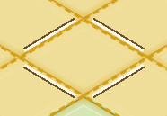
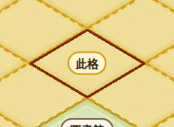
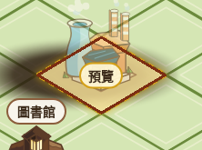
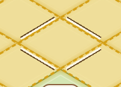
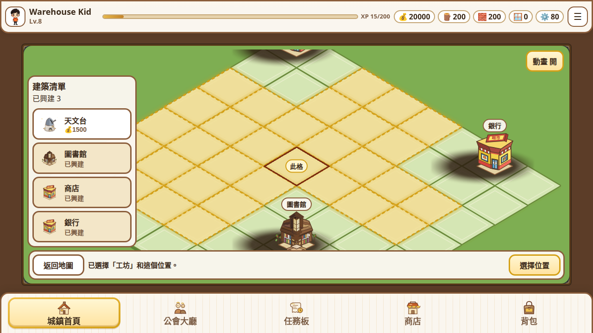

# Regress PR #61 `bbb23c0`

Verdict: **FAIL**

Tip `bbb23c0e0505b37f0eb29666471c1cd21ff4f5e3` on `cursor/green-warehouse-placement-8555`, parent `29d9957`. Read-only. No product or test file was edited. The production save `kids_town.db` was not opened by the probe server (synthetic DB only).

sha256 before and after: `c046fc41e1cf0eb8c5be5ae5a100fd62dfc6390e8c2277a6a84f93002fe3ecfb`

`git diff 29d9957 bbb23c0` is five files, 1721 insertions, 238 deletions: `backend_v2.py`, `index.html`, `service-worker.js`, `town-four-scene.css`, `town-four-scene.js`. The name `kids_town.db` does not appear in that diff (0 lines). `git diff 29d9957 bbb23c0 -- tests docs/test-cases` is empty.

Screens were asserted clean before every baseline in the main probe (18 checks) and again before the dsf-1 vertex shots. `clean_fail` is empty: 0 `#7c2d12` pixels and the ring layer hidden.

Noto CJK is installed. `#townMap .tools` at 1280×720 reports bottom **155** (top 109, height 46). The computed family is `Nunito, "Segoe UI", sans-serif`. A WenQuanYi Zen Hei override moves that bottom to **153**. Inclusive border taps on the WenQuanYi box: 0 selections in 4 samples.

## Suites

| Suite | Result | Duration |
| --- | --- | --- |
| API `pytest tests/ -m "not frontend"` | 387 passed, 151 deselected, 469 warnings | 49.60s |
| UI run 1 `pytest tests/ -m frontend` | 151 passed, 387 deselected, 4 warnings | 576.94s (0:09:36) |
| UI run 2 `pytest tests/ -m frontend` | 151 passed, 387 deselected, 4 warnings | 566.28s (0:09:26) |

The API run and UI run 1 finished before the visual probe. UI run 2 ran after that probe, overlapping the short follow-up that remeasured marks and vertex gaps. All three exited 0.

## Blockers

1. **Vertex gaps at 390×844 are 2.8–3.5px, under the 4px floor**, at both dsf 1 and dsf 2. Opposite vertices still match (≤0.7px). See the vertex tables. The on-screen edge is 25.32px because the stage is scaled into the narrow viewport. The ring drops samples whose along-edge `t` is outside `[0.1, 0.9]`, so each stub is about 10% of that edge (~2.5px). dsf 1 and dsf 2 agree, so this is not a device-pixel alias. A 4px opening at both ends of a 25.32px edge would leave at most 68% of the edge solid, so the 4px rule and the 80% rule cannot both hold on this diamond. At 1280 and 1100 the same 10% cut is 7–9.6px and passes 4–10.

2. **Inner cream gap under 2.0px at dsf 2**, on edges that are inside 2.0–3.3 at dsf 1:
   - 1280, scrolls 0 / 150 / 366: SW min 1.8, NW min 1.8 (median 2.4, max 2.8–2.9, 20–24 samples).
   - 1100, scrolls 0 and 150: SW min 1.8, NW min 1.9.
   - 1100, scroll 366: NE min 1.9; NW min 1.5, median 1.95, max 2.5 (20 samples).
   - 390, scroll 366: SE min 1.7, SW min 1.6 (24 samples). Scrolls 0 and 150 at 390 dsf 2 stay inside 2.1–3.3.

   The walker only counts a gap after three cream samples 0.1px apart, so the 1.8px mins are not a one-pixel speck. They repeat on every 1280 scroll, on the SW/NW pair whose cream centerline sits at 3.2px (NE/SE sit at 3.6px). 1.8 is 0.2 CSS px under the floor. One device pixel at dsf 2 is 0.5 CSS px, and the 1.8 sample is a different device pixel from 2.0. The 1100 scroll-366 NW median of 1.95 is the whole edge, not one station.

## Not blockers

- Solid fraction 0.788–0.798 at 1280 and 1100. Solid is the distance between the first and last cream samples on a 0.5px step, so it stops up to one pixel short of the painted run. 80% of the 83.09px edge is 66.5px; measured solid is 65.5–66.0px. The paint rule is `t` in `[0.1, 0.9]`, which is 80% of the geometric edge. Same grain at 390 (lowest 0.75, about one pixel on a 25px edge). The 390 failure that stands is the absolute gap, not this ratio.
- 390 dsf 1, scroll 0: SE and SW max 4.2 with 19 samples. Scroll 150 on that same viewport is max 3.3 with 24 samples. The 4.2 did not repeat.
- Sample counts under 20 where the edge runs into chrome: 1100 dsf 1 scroll 366 NE 19; 390 dsf 1 scroll 366 NE/NW 14; 390 dsf 2 scroll 366 NE/NW 16. The samples that were taken on those edges are inside 2.1–3.5 except the dsf 2 mins listed as blockers.
- Palette at scroll 366: raw diff 13, ink (`#7c2d12` / ring cream / ring brown) 0. Scroll 0 raw diff is 0.
- Ready bar raw diff is thousands of pixels because the status sentence changes. Ink is 0.
- Drawer open: 3 full-page `#7c2d12` pixels while `#chosenMarkPaint` is gone. Closed: 0. The drawer slide shots (200–250ms, transition is 300ms) differ by 15354 and 24021 raw pixels with 1 ink pixel. That is the panel moving, not a measured paint-through. The official UI suite’s paint-under-UI cases passed.
- Corner cell (0,0) at 1280 only: 3 of 144 inside stations missing, all on NW at distances 3.4, 3.8 and 4.2. Every other viewport is 0 missing / 144 hit. (0,7) produced 0 inside stations at every viewport (those stations are not in the visible map after scrolling the cell up). Not counted as a clip.
- Cells whose centres sit under the open palette stay in the tab order (6 buttons, `tabIndex` 0, not disabled): (0,5), (0,6), (1,6), (0,7), (1,7), (2,7). Already known. Backlog.
- After a tap, Space does not activate a button. It does scroll `#village` from 0 to 366 while `activeElement` stays `body`. Enter changes nothing. Details under probe h.
- WenQuanYi `.tools` bottom 153 rather than 155. Inclusive edge did not select a cell.
- `#dov` is `display: none` and not inert. `#dr` closed is inert (13 buttons, 0 tabbable). `#ktRotate` is `display: none` and inert at 1280×720, 390×844 and 844×390. No visible rotate rect, so the paint diff there is N/A.
- SE stroke width samples as 4px on the diagonal of the 3px stroke. Outer edge of that probe is 0 or 1px.

## Vertex gaps

Gap is the longer of the two along-edge stubs that meet at that vertex (screen px from the tip to the first cream sample). Solid is the cream run divided by the edge length. Pass needs each gap in 4–10, `|N−S|` and `|E−W|` ≤ 2, and every solid ratio ≥ 0.80.

### dsf 1

| Viewport | Edge length | N | E | S | W | \|N−S\| | \|E−W\| | NE | SE | SW | NW |
| --- | ---: | ---: | ---: | ---: | ---: | ---: | ---: | ---: | ---: | ---: | ---: |
| 1280×720 | 83.09 | 8.50 | 9.09 | 8.09 | 9.09 | 0.41 | 0.00 | 0.788 | 0.794 | 0.794 | 0.794 |
| 1100×800 | 71.41 | 7.91 | 7.50 | 7.50 | 7.41 | 0.41 | 0.09 | 0.798 | 0.791 | 0.791 | 0.791 |
| 390×844 | 25.32 | 3.50 | 3.00 | 2.82 | 2.82 | 0.68 | 0.18 | 0.750 | 0.770 | 0.790 | 0.810 |

### dsf 2

| Viewport | Edge length | N | E | S | W | \|N−S\| | \|E−W\| | NE | SE | SW | NW |
| --- | ---: | ---: | ---: | ---: | ---: | ---: | ---: | ---: | ---: | ---: | ---: |
| 1280×720 | 83.09 | 8.50 | 8.59 | 8.59 | 9.59 | 0.09 | 1.00 | 0.794 | 0.794 | 0.794 | 0.794 |
| 1100×800 | 71.41 | 7.50 | 7.00 | 7.50 | 7.50 | 0.00 | 0.50 | 0.798 | 0.798 | 0.791 | 0.791 |
| 390×844 | 25.32 | 3.50 | 3.00 | 2.82 | 2.82 | 0.68 | 0.18 | 0.750 | 0.770 | 0.790 | 0.810 |

1280 and 1100 pass the 4–10px gaps and the opposite-vertex limit. Their solid ratios sit just under 0.80 for the sampling reason above. 390 fails the 4px floor at every vertex, both scales. The 1280 ring is still a diamond a child can see: an 83px edge with about an 8px opening at each tip. The 390 ring is still a diamond; the openings are about 3px on a 25px edge.

## Inner cream gap

Min / median / max in screen px, and how many of the 24 stations found cream. The band is at least 3px clear of each vertex. Requirement: ≥20 samples and every number in 2.0–4.0.

### dsf 1

| Viewport | Scroll | NE | SE | SW | NW |
| --- | ---: | --- | --- | --- | --- |
| 1280×720 | 0 | 2.1 / 2.7 / 3.2 (24) | 2.1 / 2.7 / 3.2 (21) | 2.1 / 2.6 / 3.2 (21) | 2.1 / 2.7 / 3.3 (24) |
| 1280×720 | 150 | 2.1 / 2.7 / 3.2 (24) | 2.1 / 2.7 / 3.2 (24) | 2.1 / 2.7 / 3.3 (24) | 2.1 / 2.7 / 3.3 (24) |
| 1280×720 | 366 | 2.1 / 2.7 / 3.2 (20) | 2.1 / 2.7 / 3.2 (24) | 2.1 / 2.7 / 3.3 (24) | 2.1 / 2.7 / 3.2 (20) |
| 1100×800 | 0 | 2.0 / 2.7 / 3.2 (24) | 2.1 / 2.7 / 3.2 (22) | 2.1 / 2.7 / 3.3 (22) | 2.1 / 2.7 / 3.2 (24) |
| 1100×800 | 150 | 2.0 / 2.7 / 3.2 (24) | 2.1 / 2.7 / 3.2 (24) | 2.1 / 2.6 / 3.3 (24) | 2.1 / 2.7 / 3.2 (24) |
| 1100×800 | 366 | 2.0 / 2.7 / 3.2 (19) | 2.1 / 2.7 / 3.2 (24) | 2.1 / 2.6 / 3.3 (24) | 2.1 / 2.7 / 3.2 (20) |
| 390×844 | 0 | 2.1 / 2.6 / 3.1 (24) | 2.1 / 2.8 / 4.2 (19) | 2.2 / 2.7 / 4.2 (19) | 2.1 / 2.7 / 3.3 (24) |
| 390×844 | 150 | 2.1 / 2.6 / 3.1 (24) | 2.1 / 2.7 / 3.2 (24) | 2.1 / 2.7 / 3.1 (24) | 2.1 / 2.7 / 3.3 (24) |
| 390×844 | 366 | 2.1 / 2.6 / 3.1 (14) | 2.1 / 2.7 / 3.2 (24) | 2.1 / 2.7 / 3.1 (24) | 2.2 / 2.7 / 3.3 (14) |

### dsf 2

| Viewport | Scroll | NE | SE | SW | NW |
| --- | ---: | --- | --- | --- | --- |
| 1280×720 | 0 | 2.4 / 2.8 / 3.4 (24) | 2.4 / 2.8 / 3.4 (24) | 1.8 / 2.4 / 2.9 (24) | 1.8 / 2.4 / 2.9 (24) |
| 1280×720 | 150 | 2.4 / 2.8 / 3.4 (24) | 2.4 / 2.8 / 3.4 (24) | 1.8 / 2.4 / 2.9 (24) | 1.8 / 2.4 / 2.9 (24) |
| 1280×720 | 366 | 2.4 / 2.9 / 3.4 (20) | 2.4 / 2.8 / 3.4 (24) | 1.8 / 2.4 / 2.9 (24) | 1.8 / 2.4 / 2.8 (20) |
| 1100×800 | 0 | 2.3 / 2.9 / 3.5 (24) | 2.3 / 2.9 / 3.4 (24) | 1.8 / 2.4 / 3.0 (24) | 1.9 / 2.4 / 3.0 (24) |
| 1100×800 | 150 | 2.3 / 2.9 / 3.5 (24) | 2.3 / 2.9 / 3.4 (24) | 1.8 / 2.4 / 3.0 (24) | 1.9 / 2.4 / 3.0 (24) |
| 1100×800 | 366 | 1.9 / 2.5 / 3.1 (20) | 2.8 / 3.3 / 3.8 (24) | 2.2 / 2.9 / 3.4 (24) | 1.5 / 2.0 / 2.5 (20) |
| 390×844 | 0 | 2.1 / 2.6 / 3.1 (24) | 2.1 / 2.7 / 3.2 (24) | 2.1 / 2.7 / 3.1 (24) | 2.1 / 2.7 / 3.3 (24) |
| 390×844 | 150 | 2.1 / 2.6 / 3.1 (24) | 2.1 / 2.7 / 3.2 (24) | 2.1 / 2.7 / 3.1 (24) | 2.1 / 2.7 / 3.3 (24) |
| 390×844 | 366 | 2.4 / 3.1 / 3.5 (16) | 1.7 / 2.3 / 2.8 (24) | 1.6 / 2.2 / 2.7 (24) | 2.6 / 3.2 / 3.5 (16) |

Ring centre stays on the cell: distance 0.1–0.5px at every viewport and scroll above. The line stays on (3,3) at scroll 0, 150 and 366 (chosen cell and 「此格」 badge). Line pixel totals: 1280 is 858 / 954 / 874, 1100 is 671 / 752 / 729, 390 is 245 / 258 / 236.

## Probe b — mark lifecycle

Seed: 商店 at (0,0), 圖書館 at (5,5), 銀行 at (6,0). 工坊 is the new building. (3,3) does not overlap those footprints. Cancel is a second tap. Brown counts are full-page `#7c2d12` pixels.

| Step | Result |
| --- | --- |
| Select then cancel, 1280 | line 954px before, brown 0 after, mark layer gone |
| Select then cancel, 1100 | line 804px before, brown 0 after, mark layer gone |
| Select then cancel, 390 | line 258px before, brown 0 after, mark layer gone |
| Back to scene 1 | scene 「場景 1 · 查看地圖」, brown 0, mark gone |
| Task board | brown 0, mark gone |
| Back from tasks | scene 2, brown 0, mark gone |
| Scene 3, select (2,2) then (4,3) | `#uxPlaceBar` visible, `#readyBar` not. Line on (4,3): 953px, badge 「預覽」. Line on (2,2): 0 |
| Sheet open on 商店 | brown 0, mark gone while the sheet is up |
| Sheet closed | chosen back on (3,3), badge 「此格」, line 954px |
| Menu drawer open / closed | class `dr o` then `dr`. Brown 3 while open with the mark layer already gone; 0 after close |
| Successful place | toast 「起好「工坊」。」, brown 0, chosen none, scene 「場景 4 · 升級」 |
| Reload | scene 1, brown 0, chosen none |

Scene 3’s confirm bar is `#uxPlaceBar`. The line follows the new cell, not the cell that was selected in scene 2.

## Probe c — ring lifecycle

| Step | Ring layer px | Notes |
| --- | --- | --- |
| Focus (3,3) | 21576 | This helper counts the SVG box, not the ink. The ink is in the gap tables |
| Blur | 0 | full-page brown 0 |
| Leave to scene 1 | 0 | brown 0 |
| Footer tab to tasks | 0 | brown 0 |
| Open the bank sheet | 0 (was 21576 before) | brown 0 |
| Resize 1280 → 390 with the ring up | stays shown | distance to the new cell 0.2px, distance to the old 1280 spot 449.4px |
| Resize back to 1280 | stays shown | distance to the cell 0.3px |

The ring does not stay parked at the pre-resize coordinates.

## Probe d — scroll

Covered by the inner-gap tables. Line and ring stay on (3,3) at scroll 0, 150 and 366 for 1280, 1100 and 390. Max scroll observed is 366 at all three viewports.

## Probe e — paint under UI

Diff is the palette or bar rectangle against a clean shot at the same scroll. Ink is `#7c2d12`, ring cream `#fff8e7`, or ring brown `#6b4f2a`.

| Surface | Scroll | Select raw / ink | Focus raw / ink |
| --- | ---: | --- | --- |
| `#palette` | 0 | 0 / 0 | 0 / 0 |
| `#readyBar` | 0 | 4304 / 0 | 4303 / 0 |
| `#palette` | 366 | 13 / 0 | 13 / 0 |
| `#readyBar` | 366 | 3792 / 0 | 3792 / 0 |
| `#actionSheet` (Enter on the bank) | 0 | 0 / 0 | sheet visible |
| `#toast` | — | 0 / 0 | toast rect 209×39.5 at (535.5, 600.5) |

The cell under the palette was (0,5) at scroll 0 and (1,6) at scroll 366, selected from the keyboard because the launcher hides while the list is open. The ready-bar raw diff is the status copy. The 13 palette pixels at scroll 366 are not mark or ring colours.

## Probe f — layer order

On the chosen cell and the library sprite at (5,5):

| Layer | z-index |
| --- | --- |
| Gold `.mark` on an empty-hot cell | 3 |
| Building sprite | 6 |
| `#chosenMarkPaint` line | 7 |
| Badge | 8 |
| `#focusRingPaint` | 9 |
| Palette | 20 |
| `#focusRingLift` | 31 (hidden during this shot) |

Line samples on (3,3): NE 242, SE 238, SW 235, NW 239, total 954, outer edge 0.54–0.85px. Badge present, text 「此格」, cream 633, brown 36. Ring-over-sprite interior samples sit on the cell (near, not brown). Order matches tile/gold, then sprite, then line, then badge, then ring.

## Probe g — edge cells

`inside_missing / inside_hit` for the cream band inside the visible map:

| Cell | 1280 | 1100 | 390 |
| --- | --- | --- | --- |
| (0,0) | 3 / 141 | 0 / 144 | 0 / 144 |
| (7,0) | 0 / 144 | 0 / 144 | 0 / 144 |
| (0,7) | 0 / 0 | 0 / 0 | 0 / 0 |
| (7,7) | 0 / 144 | 0 / 144 | 0 / 144 |

The three misses at 1280 (0,0) are NW samples at 3.4, 3.8 and 4.2px outside the edge (the shop cell). (0,7) never placed a station inside the visible map.

## Probe h — keyboard

Mouse tap on (3,3) at 1280, scroll 0, scene 2, 工坊 selected.

**Tab after the tap: pass.** It does not restart at the top bar or the first button.

| | activeElement | cell | chosen | ring layer |
| --- | --- | --- | --- | --- |
| After the tap | `body.kt-landscape.kt-artstage` (no id, no aria-label) | none | (3,3) 「此格」 | 0 |
| After Tab | `button.cell-btn` (no id) | (4, 3) | still (3,3) | 21460 |

The Tab target’s aria-label is 「第 5 欄第 4 行，空地，點選即可選擇」. Box: top 503, left 693, 37×37. (3,3) is 「第 4 欄第 4 行」. (4,3) is the next cell in that row.

**Space and Enter do not activate another button.** Each key is a fresh tap of (3,3) with scroll reset to 0 first. `activeElement` is `body` before and after both keys. Scene stays 「場景 2」. Sheet stays closed. `#uxPlaceBar` stays hidden. Toast stays empty.

| Key | Before | After |
| --- | --- | --- |
| Space | `body`, chosen (3,3), scroll 0 | `body`, chosen (3,3), scroll **366** |
| Enter | `body`, chosen (3,3), scroll 0 | `body`, chosen (3,3), scroll 0 |

Space’s only state change is `#village` scrolling from 0 to 366. No button id gains focus, and the selection does not clear or move.

Shift+Tab from a focused (3,3) moves to (2,3) (「第 3 欄第 4 行」). Tab returns to (3,3). The ring layer is shown while (3,3) is focused (21576).

`HTMLElement.prototype.focus` is `function focus() { [native code] }`. `blur` is `function blur() { [native code] }`.

## Probe i — previous checks

**Stroke.** `#chosenMarkPaint` polygon is `#7c2d12`, `stroke-width` 3. Interior of the diamond matches the clean shot (`interior_bad` empty) on (3,3) and (4,0). Badge 「此格」. Gold pixels inside the stroke samples: 0.

| Cell | NE | SE | SW | NW |
| --- | --- | --- | --- | --- |
| (3,3) | width 3, outer 1, inset 1.0 | width 4, outer 0, inset 1.5 | width 3, outer 0, inset 1.0 | width 3, outer 1, inset 0 |
| (4,0) | width 3, outer 1, inset 1.0 | width 4, outer 0, inset 1.5 | width 3, outer 0, inset 1.0 | width 3, outer 1, inset 0 |

Contrast of `#7c2d12` against the fills that were actually beside the line: gold 6.95 (both cells), grass 3.60 and empty 7.05 on (4,0). All measured pairs are ≥ 3:1. Dark-gold was not adjacent to these edges, so it was not sampled.

**Half-pixel row.** Village bottom 541. y = 541.5, 72 taps, 0 reactions.

**Boundaries.** Inclusive edge samples selected 0 cells on the palette (8), `.tools` (8) and the ready bar (8). Points outside the palette and `.tools` also selected 0. Two of eight points just outside the ready bar selected a cell (the bar itself did not). Tools bottom 155. The three points in the band under the bar — (640, 609), (930.5, 609), (404.4, 609) — selected nothing and raised no toast. The 0–1px band was not asserted.

**Same-text toast.** Two taps on (7,0). That cell is inside the bank at (6,0), so the toast is 「這個位置已經有建築物。」 both times, not the unfit sentence. The opacity checker did not report a dip to 0, a node swap, or a fade that returns to full opacity. The only problem string is the text mismatch against the unfit sentence the probe asked for.

**Inert.** Closed `#dr`: inert, 13 buttons, 0 tabbable. `#ktRotate`: `display: none`, inert. `#dov`: `display: none`, inert false.

**Formal API.** `POST /api/kids/<id>/buildings` for 圖書館 (already placed) returns 400 `{"error": "你已經興建了這種建築物。"}`.

**Guards** (forced confirm response, then the toast):

| Case | Toast | Raw English / JSON |
| --- | --- | --- |
| `detail` array | 這個位置放不下這座建築物。 | none |
| no `detail` | 這個位置放不下這座建築物。 | none |
| English `detail` | 這個位置放不下這座建築物。 | none |
| formal body | 你已經興建了這種建築物。 | none |

The generic checker flags the formal sentence only because that checker requires the unfit sentence. The formal toast is the server sentence, which is what the UI case asks for. The UI suite’s place-server-message test passed.
