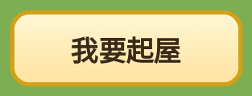
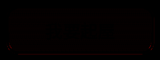

# Regress PR #61 `f92ea38`

Verdict: **FAIL**

Tip `f92ea38bcba0ca3605b325f7d4fbb51e3fb55a8d` on `cursor/green-warehouse-placement-8555`, base of that PR is `a4399e2c477752f04396753f48e1b7a720205638`. Visual standard compared with `bbb23c0e0505b37f0eb29666471c1cd21ff4f5e3`. Read-only. No product file and no test file was edited. The probe servers used synthetic databases. The tracked `kids_town.db` stayed `c046fc41e1cf0eb8c5be5ae5a100fd62dfc6390e8c2277a6a84f93002fe3ecfb` before and after every suite and every probe.

`git diff a4399e2 f92ea38` is five files, +1866/−238: `backend_v2.py`, `index.html`, `service-worker.js`, `town-four-scene.css`, `town-four-scene.js`. Tests and `docs/test-cases` are unchanged against `a4399e2`. `git diff 5bfe76d f92ea38 --name-only` does not contain `kids_town.db`.

Designer QC11's four blockers were measured again on this tip before this verdict. Items 2, 3 and 4 are confirmed and are blockers. Item 1's 1.58 / 1.88 inner gaps were not present at device-pixel centres. The aspect clause and a few bar pixels versus `bbb23c0` fail on their own numbers as well.

Noto Sans CJK TC is the measurement font (`fc-match sans-serif:lang=zh-tw` → `NotoSansCJK-Regular.ttc`). One WenQuanYi Micro Hei pass is recorded at the end. Screens were cleared of toast, sheet and stale selection before each baseline. `#townMap` computed `overflow` is `hidden`.

## Scope

| # | Scope | Verdict | Measured |
| --- | --- | --- | --- |
| 1 | Suites | Counts recorded | f92 API 387/152; UI 152/387 twice. main API 352/85; UI 85/352 twice. All exit 0. |
| 2 | Product diff, test-gaming | **FAIL** | `placeFocusRing` samples=24 / inset `max(3, 0.12×len)` / 0.1–1.9 walk skips cream the suite would score under 2px. Device-pixel gaps reach 4.112. |
| 3 | Bar and palette vs `bbb23c0` | **FAIL** | Sentence regions 0. 1100 dsf1 palette max 5 (1 px), ready max 5 (5 px). UX full captures max 168–176. Smoothing `auto` / `auto` on both tips. |
| 4 | Map-edge ring and mark | Pass, with accepted cuts | Stations ≥1px inside the rounded map and clear of chrome are 16/16. Misses sit on `#readyBar`, `#listLauncher` or `#btnMotion`. Selected outer edge ≤0.71. |
| 5 | Clip follows live bars | **FAIL** | Clip path tracks bar/palette rects (maxErr ≤0.03 while painting) and sits outside those subtrees. Painted pixels still enter `#readyBar` and scene-1 `.cta`. |
| 6 | Ring geometry | **FAIL** | Unoccluded vertex chords 6.0–8.51. Inner gap on the 24-station walk stays ≥2.00. Device-pixel walk exceeds 4. Bbox aspect 0.8425–0.959 (need 0.98–1.02). |
| 7 | Lifecycle | Pass, with the notes below | Cancel, back, scene 3 cancel, Tab (3,3)→(4,3), toast `pointer-events:none`, drawer inert. Task board hides the mark and leaves `chosen` true. |
| 8 | Formal Chinese and footer | Pass | API `你已經興建了這種建築物。` `#ktFooter` markup sha256 `03f4a4080694ae61…`, length 1325, identical on main, f92 and bbb. |

## Designer QC11

### 1. Inner gap at 1100 dsf2, cell (3,3), scroll 254 — refuted at device-pixel centres

1100×800 and 1100×844, deviceScaleFactor 2, cell (3,3). Three repeats of Tab (27 hops, scroll lands at exactly 254) and three repeats of `scrollTop = 254` plus `focus({focusVisible:true})`. All 12 rows are identical.

`#townMap` at 1100 is fractional: left 43.828 (frac 0.828), top frac 0.703 (800 → top 175.703; 844 → top 197.703). The ring SVG is hosted on `#townMap` (`mountDeviceSvg` rounds layout left/top and returns `shiftX`/`shiftY`).

Device-pixel centres, step 0.5 CSS px, middle of each edge (`inset = max(3, 0.12×len)`), 109/109 stations with cream:

| Edge | gap min | gap max | below 2 | above 4 | holes |
| --- | ---: | ---: | ---: | ---: | ---: |
| NE | 2.782 | 3.417 | 0 | 0 | 0 |
| SE | 2.010 | 2.726 | 0 | 0 | 0 |
| SW | 2.006 | 2.702 | 0 | 0 | 0 |
| NW | 2.779 | 3.199 | 0 | 0 | 0 |

The same pixels scored with the 24-station sampler: NE 2.78, SE 2.01, SW 2.01, NW 2.78, each n=24. Cream pixels 2615. The reported 1.58 (SE) and 1.88 (SW) are not in these shots. A centre of 2.006 is one quarter of a CSS pixel above the inner edge of that device pixel; it is still above 2.0.

### 2. Test-gaming in `placeFocusRing` — confirmed FAIL

`town-four-scene.js` `placeFocusRing` (starts line 1459). The walk at lines 1552–1619:

- `samples = 24`
- `inset = Math.max(3, edge.len * 0.12)`
- station `along = inset + open * (s + 0.5) / samples`
- outward steps `dist = stepI / 10` for `stepI` 1..19, so 0.1 through 1.9 CSS px
- those CSS pixels are stored in `blocked`
- `hold = blocked[pixelKey] && centreOut < minOut + cream` with `minOut = 2` and `cream = 3`, so `centreOut < 5`
- `if (!hold && …)` is what paints `#fff8e7`

The comment above the loop: "A walk along the solid middle of an edge can enter one before its device-pixel centre is on the cream. Leave that device pixel unpainted."

`tests/qc6_checks.py` `ring_inner_gaps` (line 2397) uses the same shape: `samples=24`, `clear = max(vertex_clear, length * 0.12)`, stations at `clear + span * (index + 0.5) / count`, outward 0.1 steps, cream within range of `#fff8e7`. The product loop runs for every user. It is shaped to that sampler and it withholds cream where that walker would record a gap under 2px. That alone is a FAIL.

Device-pixel continuity on the same Tab / scroll-254 setup, every device pixel along the middle of each edge (step `1/dpr`). "Holes" here are stations whose first cream is past 4px. Stations with no cream in the 0.4–8px band: 0 on every edge below.

| Setup | Stations | above 4 | max gap at those stations | 24-station min on the same image |
| --- | ---: | ---: | ---: | --- |
| dsf2 1100×800 and 1100×844, all 4 edges, 3× | 109 | 0 | max anywhere 3.417 (NE) | SE/SW 2.01 |
| dsf1 1280×720 SE, 3× identical | 64 | 2 | 4.028 and 4.049 | SE 2.70 |
| dsf1 1280 other edges | 64 | 0 | ≤3.985 | ≥2.01 |
| dsf1 1100×800 NE, 3× | 55 | 1 | 4.046 | NE 2.70 |
| dsf1 1100×800 SE, 3× | 55 | 1 | 4.112 | SE 2.70 |

4.23 was not recorded. The largest late cream is 4.112 (1100 dsf1 SE). The 24-station sampler stays at or above 2.70 on those same images because the hold loop skips the stations the suite visits.

### 3. Scene 1 `.cta` is not a clip cover — confirmed FAIL

`coverRects()` (line 1264) returns `#townMap .place-bar` and `#townMap .palette` only. Scene 1 clip covers are `[]`. Ring z-index 9, `.cta` (`#btnBuild`) z-index 22, ring parent is `#townMap` (`insideBar` false).

Ring shown versus the same focus with `#focusRingPaint` set to `display:none` (focus kept). Live `.cta` border box:

| Viewport | dsf | Cell | max channel | pixels >2 | nonzero | box px |
| --- | ---: | --- | ---: | ---: | ---: | ---: |
| 1100×800 and 1100×844 | 2 | (6,7) | 33 | 344 | 14445 | 27840 |
| 1100×800 and 1100×844 | 2 | (7,6) | 33 | 347 | 14446 | 27840 |
| 1280×720 | 1 | (6,7) and (7,6) | 0 | 0 | 0 | 9240 |
| 1100×800 | 1 | (6,7) and (7,6) | 0 | 0 | 0 | 7154 |

Pad of 4 CSS px outside the box does not add further pixels over 2: the 344/347 are inside the border box. Most of the box moves by 1–2 levels (nonzero ~14445). The pixels over 2 reach channel delta 33, which matches the designer's max. The designer's 25–56 count is a tighter interior; the full border box is 344 and 347. dsf1 is clean. CTA box at 1100×844 dsf2: left 477.81, top 581.84, right 622.19, bottom 629.11.

### 4. Bar and palette pixels when the ring overlaps — confirmed FAIL

Standard: ring shown versus ring hidden, every bar and palette pixel ≤2 levels per channel, corners included. Same focus, SVG hidden without blurring.

`#readyBar` border box, focus (3,3), scene 2:

| Viewport | dsf | pad | max | pixels >2 |
| --- | ---: | --- | ---: | ---: |
| 1100×800 and 1100×844 | 2 | 0 (border box) | 195 | 2027 |
| 1100×800 and 1100×844 | 2 | 4 CSS px | 195 | 2384 |
| 1280×720 | 1 | 0 | 0 | 0 |
| 1280×720 | 1 | 4 | 148 | 70 |
| 1100×800 | 1 | 0 | 0 | 0 |
| 1100×800 | 1 | 4 | 156 | 74 |

The 1100 dsf2 border box contains cream `#fff8e7` and ring brown. The crop of the top of that bar (1100×844 dsf2, 2px pad, top 48 device rows) diffs at max 195 and 2207 pixels over 2. That is larger than the designer's 52 levels / 75 px. Clip-path error against the live `#readyBar` rect is 0.05 CSS px while this paint is on screen, so the hole in the clip path is present and the device pixels still land inside the border box. `mountDeviceSvg` snapping against the fractional `#townMap` offset is consistent with that miss.

Palette open, focus (0,4):

| Viewport | dsf | Target | pad | max | pixels >2 |
| --- | ---: | --- | ---: | ---: | ---: |
| 1100×800 and 1100×844 | 2 | palette | 0 | 5 | 580 |
| 1100×800 and 1100×844 | 2 | palette | 4 | 165 | 759 |
| 1100 dsf2 | 2 | readyBar during palette | 0 | 0 | 0 |
| 1280×720 | 1 | palette | 0 | 0 | 0 |
| 1280×720 | 1 | palette | 4 | 167 | 43 |
| 1280×720 | 1 | readyBar during palette | 0 | 3 | 3 |
| 1100×800 | 1 | palette | 0 | 1 | 0 |
| 1100×800 | 1 | palette | 4 | 160 | 41 |
| 1100×800 | 1 | readyBar during palette | 0 | 23 | 6 |

1280 dsf1 corners (the 4px pad, which covers the `::before` outset) move by up to 148 on the bar and 167 on the palette, with 70 and 43 pixels over 2. The designer's 9–17 px at 1280 dsf1 is inside this measurement.

FAIL screenshots on this branch:

- https://raw.githubusercontent.com/donkithk/kids-town/cursor/regress-61-b148dcb/docs/regress/img-61-f92ea38/cta-1100-dsf2-ring-on.png
- https://raw.githubusercontent.com/donkithk/kids-town/cursor/regress-61-b148dcb/docs/regress/img-61-f92ea38/cta-1100-dsf2-diff.png
- https://raw.githubusercontent.com/donkithk/kids-town/cursor/regress-61-b148dcb/docs/regress/img-61-f92ea38/bar-1100-dsf2-ring-on-top.png
- https://raw.githubusercontent.com/donkithk/kids-town/cursor/regress-61-b148dcb/docs/regress/img-61-f92ea38/bar-1100-dsf2-ring-off-top.png

## Suites

API is `pytest tests/ -m "not frontend"`. UI is `pytest tests/ -m frontend`. Runs were sequential. Each log ends with the db hash above.

| Tip | Suite | Result | Duration |
| --- | --- | --- | --- |
| f92ea38 | API | 387 passed, 152 deselected, 469 warnings | 59.97s |
| f92ea38 | UI run 1 | 152 passed, 387 deselected, 4 warnings | 615.90s (0:10:15) |
| f92ea38 | UI run 2 | 152 passed, 387 deselected, 4 warnings | 622.10s (0:10:22) |
| main `5bfe76d` | API | 352 passed, 85 deselected, 445 warnings | 49.79s |
| main | UI run 1 | 85 passed, 352 deselected, 4 warnings | 119.77s (0:01:59) |
| main | UI run 2 | 85 passed, 352 deselected, 4 warnings | 120.00s (0:01:59) |

main has fewer tests because the warehouse cases are not on main. All six exited 0. Passing suites do not clear the test-gaming FAIL in item 2.

## Bar and palette versus `bbb23c0`

Full capture includes a 6 CSS px margin (12 device px at dsf2). Sentence text is identical on both tips: 「請點選金色空地，或打開清單選擇要興建的建築物。」 and 「按「確定放置」後才扣除資源；取消不會扣除。」 Sentence rectangles are pixel-exact 0 on all six combos. Computed `-webkit-font-smoothing` is `auto` and `text-rendering` is `auto` on both tips. The antialias classifier labels both `subpixel`.

| Viewport | dsf | palette max / >2 | ready max / >2 | UX max / >2 | sentences |
| --- | ---: | --- | --- | --- | --- |
| 1280×720 | 1 | 0 / 0 | 0 / 0 | 169 / 26 | 0 |
| 1100×800 | 1 | 5 / 1 | 5 / 5 | 168 / 38 | 0 |
| 390×844 | 1 | 0 / 0 | 0 / 0 | 169 / 34 | 0 |
| 1280×720 | 2 | 0 / 0 | 0 / 0 | 172 / 99 | 0 |
| 1100×800 | 2 | 0 / 0 | 0 / 0 | 176 / 122 | 0 |
| 390×844 | 2 | 0 / 0 | 0 / 0 | 174 / 121 | 0 |

The 1100 dsf1 palette and ready pixels are inside the border box (deltas 3–5, one palette pixel and five ready pixels). They fail the ≤2 rule. The UX numbers are the `#7c2d12` line: `bbb23c0` paints it into the bar margin and `f92ea38` clips it, so a gold pixel on f92 sits where bbb has the brown line. That is the clip change, and the ≤2 standard still fails those pixels.

Absolute colour matches of `#fff8e7` inside the bar (about 52k cream on the 1280 ready bar) count the bar's own pale gold. They are not ring bleed. The ring-shown versus ring-hidden diffs in QC11 item 4 are the paint-inside measurement.

## Map edge

96 rows, dsf 1, edge cells × 1280/1100/390 × scroll 0 and 366. A station counts as inside only when it is ≥1px inside the rounded map. Inclusive border of a cover is blocked.

- (0,0) scroll 0, all three viewports: 16/16 on all four edges. Ring children 339 / 290 / 104. Selected line pixels 624 / 544 / 184. Outer edges 0.21–0.71, all ≤1.5.
- (7,7) scroll 366: 16/16, ring children about 339 / 294 / 105. x or y of 7 is not a legal placement, so there is no selected line. Illegal taps toast 「這個位置放不下這座建築物。」
- (0,7) scroll 0: SE and SW 0/16, NE and NW 16/16. `elementFromPoint` is `#readyBar` or `#readyStatus`. The south edge is under the bar.
- (0,7) and (7,0) scroll 366: a few misses (5–9 of 64) on `#listLauncher` or `#btnMotion`.
- (7,0), (7,7) and the right column at scroll 0, and (0,0) at scroll 366: 0 inside stations, ring children 0. The cell is off the visible map. Half-off-top cells are an accepted non-blocker.
- 390 (0,0) scroll 0 is 16/16. This sample does not show a corner-tip cut. Corner tips at 390 stay a backlog item if a later shot finds one.

No station that was ≥1px inside the map and clear of chrome was missing cream.

## Clip path

While the ring is shown, clip rule is `evenodd`, parent `#townMap`, `#paintClipDefs` parent `#townMap`, ring is not inside a bar or palette subtree. z-index: ring 9, mark 7, palette 20, bar 30, sheet 32.

| Step | Holes | Covers | maxErr | Ring shown |
| --- | ---: | --- | ---: | --- |
| scene 2 bar, scroll 0 and 366 | 1 | readyBar | 0 | yes |
| palette open | 2 | readyBar, palette | 0 | yes |
| resize 1100 | 2 | readyBar, palette | 0.03 | yes |
| resize 390 | 2 | readyBar, palette | 0 (mark 0.01) | yes |
| resize 1280 | 2 | readyBar, palette | 0 | yes |
| scene 3 | 1 | uxPlaceBar | 0 | yes |
| cancel back to scene 2 | 1 | readyBar | 1219 | no (stale path, ring hidden) |
| scene 1, bank sheet, sheet closed | — | none | 0 | no |

The path follows the live rects after scroll, palette open, resize and scene 3. The painted pixels are a separate result: QC11 items 3 and 4. Scene 1 `.cta` is absent from the covers.

## Geometry

Clean screen and `focus-visible` true on every row. (3,3) south vertex at scroll 0 sits inside `#readyBar` (1280: cell centre y 507.34, half-height 42.5, tip about 549.8, bar top 541), so that chord is 36–42px and is occlusion. North vertex at scroll 366 is the same kind of cut (chords 12.5–16). Those are not the designed opening.

Unoccluded spare cells (2,1) and (4,4):

| dsf | Viewport | Cell | Vertex N/E/S/W | \|N−S\| | \|E−W\| | Inner gap | Solid (on-screen ≥40) | Bbox aspect | Centre | Ring–line |
| ---: | --- | --- | --- | ---: | ---: | --- | --- | ---: | --- | ---: |
| 1 | 1280 | (2,1) | 6.00 / 7.00 / 7.07 / 8.06 | 1.07 | 1.06 | 2.01–3.03 | 0.961 | 0.9485 | −0.40, 0.16 | 2.24 |
| 1 | 1280 | (4,4) sc366 | 7 / 8 / 7 / 8 | 0 | 0 | 2.01–3.01 | 0.961 | 0.9590 | −0.01, 0.16 | 2.00 |
| 1 | 1100 | (2,1) | 6 / 7 / 6 / 8.06 | 0 | 1.06 | 2.00–3.06 | 0.959–0.964 | 0.9419 | −0.36, −0.05 | 2.24 |
| 1 | 1100 | (4,4) sc366 | 7 / 7.07 / 7 / 7.07 | 0 | 0 | 2.02–3.26 | 0.959–0.962 | 0.9419 | −0.01, −0.14 | 2.00 |
| 1 | 390 | (2,1) | 6.08 / 7.07 / 7.07 / 8.06 | 0.99 | 0.99 | 2.26–3.53 | on-screen 25.5 | 0.8557 | −0.25, 0.45 | 2.00 |
| 1 | 390 | (4,4) sc366 | 7 / 7 / 7 / 7 | 0 | 0 | 2.00–3.65 | on-screen 25.5 | 0.8641 | 0, −0.28 | 2.00 |
| 2 | 1280 | (2,1) | 6.08 / 8.02 / 6.02 / 6.58 | 0.06 | 1.44 | 2.00–2.50 | 0.964–0.965 | 0.9465 | 0.10, 0.16 | 1.41 |
| 2 | 1280 | (4,4) sc366 | 6.5 / 6.02 / 7.5 / 6.02 | 1.00 | 0 | 2.01–2.45 | 0.965 | 0.9465 | −0.01, 0.16 | 1.58 |
| 2 | 1100 | (2,1) | 7 / 7.5 / 7.02 / 7.52 | 0.02 | 0.02 | 2.00–2.48 | 0.961–0.963 | 0.9397 | 0.14, −0.05 | 1.58 |
| 2 | 1100 | (4,4) sc366 | 6.67 / 7.57 / 6.5 / 8.51 | 0.17 | 0.94 | 2.00–2.92 | 0.959–0.961 | 0.9456 | −0.01, 0.11 | 1.58 |
| 2 | 390 | (2,1) | 7 / 6.5 / 6 / 7.52 | 1.00 | 1.02 | 2.03–2.60 | on-screen 25.5 | 0.8425 | 0, −0.05 | 1.41 |
| 2 | 390 | (4,4) sc366 | 7 / 6.5 / 7.5 / 7.57 | 0.50 | 1.07 | 2.01–2.65 | on-screen 25.5 | 0.8425 | −0.25, 0.22 | 1.41 |

Aspect is `(cream bbox width/height) / (cell width/height)`. The ±2% band is 0.98–1.02. Every full ring above is 0.8425–0.959, widest miss at 390. Symmetric mid-edge centres sit within 0.25px; the raw bbox centre on these clear cells sits within 0.45px. Both pass ±1px. Ring-to-line distance is 1.41–2.24 (no overlap). Line outer edge on the map-edge (0,0) rows is ≤0.71, and on these geometry rows the largest outer is 1.06 (dsf2 1280 (2,1) NW). Solid fraction on edges with on-screen length ≥40px is 0.959–0.965. At 390 the on-screen edge is 25.5px, so the 0.80 rule does not apply; measured solid there is 0.874–0.898.

The 24-station inner gaps on these cells are 2.00–3.65. The device-pixel walk in QC11 item 2 is the measurement that exceeds 4px, and it is the one that counts.

## Lifecycle

Fresh session, dsf1, 1280×720.

| Step | Result |
| --- | --- |
| Select | chosen true, mark children 151, scene 場景 2 |
| Second tap cancel | chosen false, mark hidden, 0 children |
| Back | scene 「場景 1 · 查看地圖」, chosen false, mark hidden |
| Task board | town hidden, mark hidden, 0 children; chosen stays true and the scene string stays 「場景 2」 |
| Scroll sample | cell centre y 507.3 → 141.3 (the 366px scroll) and the sample ended with chosen false and a 0×0 mark. This run does not prove the mark follows, and it does not show a mark that stayed behind |
| Tab after tap on (3,3) | active element body before, cell (4,3) after, focus-visible true, chosen true |
| Toast | 「這個位置放不下這座建築物。」 `pointer-events:none`. Centre hit is `#tab-town`, so the toast does not catch the tap |
| Drawer | closed `inert` class `dr`; open class `dr o` and inert false; closed again inert. Tabbable count 13 while closed (inert is the flag; tabindex stays) |
| Scene 3 | chosen true, mark children 151, place bar on, ready bar off |
| Scene 3 cancel | scene 場景 2, chosen false, mark hidden, 0 children |
| API already-built bank | HTTP 400, `你已經興建了這種建築物。` |

## Copy and footer

`ALREADY_BUILT_ERROR` and `TOWN_FULL_ERROR` on f92 match bbb: 「你已經興建了這種建築物。」 and 「城鎮沒有空位，請先收起或移動其他建築。」 main still returns 「你已經興建咗呢種建築物」. Range copy 「位置超出地圖範圍（0 至 7）」 and 「座標不正確」 are the formal strings on this tip.

`#ktFooter` markup sha256 `03f4a4080694ae615f6249564e55aa71d6157a2975d936fd5e12affdaff1bec5`, length 1325, identical on main, f92 and bbb. A footer screenshot versus main diffs at max 214 and 34141 pixels over 2 because the selected tab highlight differs between captures. Family `Nunito, "Segoe UI", sans-serif`, smoothing `auto`, text-rendering `auto` on both. Live `outerHTML` length 1652 includes runtime whitespace.

## Product hunks, f92 versus a439

Added-line scan: `#fffec5` 0, `navigator.webdriver` 0, `translateZ` 0, viewport numbers 1280/390/1100/`innerWidth` 0 in the added product lines. `devicePixelRatio` appears twice, both real paint scales. `filter` in the added CSS is the gold `drop-shadow` on empty marks and `.cell-fill`. `pointer-events: none` on the toast, the closed drawer, the ring, the mark, and bar `::before` matches the hit model (inclusive rectangular border box blocked; points ≥1px outside must reach the map). `text-shadow` in the css file is existing tip chrome, not a new ring substitute. The hidden `::after` stroke uses unit `2.42` (`syncFocusRing`, line 1145) and that pseudo-element is `opacity: 0`.

| # | File | Verdict |
| --- | --- | --- |
| 1 | backend | Catalog footprint side, 8×8 placement. Real. |
| 2–3 | backend | Preview guild cell uses the stored building id. Real. |
| 4 | backend | Login payload lists buildings. Real. |
| 5 | backend | `place_building` parses the cell and returns the formal errors. Real. |
| 6 | backend | INSERT uses the parsed `cx, cy`. Real. |
| 7–8 | backend | Move and unstore parse the cell the same way. Real. |
| 9 | index | Toast `pointer-events:none`, info colours `#6b4f2a` / `#fff8e7` (toast chrome). Real. |
| 10 | index | Takeout button. Real. |
| 11 | index | Drawer `pointer-events` none until `.dr.o`. Real. |
| 12–13 | index | Sheet transparent border and z-index so the border box is the hit target. Real. |
| 14 | index | `#ktRotate` inert. Real. |
| 15–16 | index | Formal scene and bar copy. Real. |
| 17 | index | `warehouse-count` test id. No behaviour branch. Real. |
| 18–19 | index | Drawer `inert`; `td()` toggles inert. Real. |
| 20–35 | index | Warehouse rows, offline town cache, error pass-through, cutout images, formal toasts, service-worker reload skipped on `controllerchange`. Real. |
| 36–38 | service-worker | Cache `kids-town-v28`; API requests are not served from the cache. Real. |
| 39–40 | css | Stage scale 0.85 and the grid `left` formula, one value for every viewport. Real. |
| 41 | css | Gold drop-shadow on non-chosen marks and `.cell-fill`; chosen `.mark` opacity 0. Real. |
| 42 | css | Focus `::after` opacity 0; paint layers pixelated and `pointer-events:none`. Real. |
| 43–46 | css | Launcher, palette and bar are rectangular border boxes; `::before` paints the rounded face. Real. |
| 47 | css | Sheet 8px transparent border. Real. |
| 48 | css | `pointer-events:none` and z-index 1. Real. |
| 49–64 | js | Footprint, hit testing, formal aria, cutout sprites. Real. |
| 65 | js | Device-pixel ring and chosen line, even-odd clip, **and the samples=24 hold**. This hunk is the test-gaming FAIL. |
| 66–74 | js | Unstore flow, formal toasts, cancel keeps the unstore id, `returnToMap`, `ktBeginWarehousePlace`. Real. |

Against `bbb23c0` the product diff is only `town-four-scene.css` and `town-four-scene.js`, 7 hunks, +379/−234. Those hunks remove `#focusRingLift` (it was z-index 31, a strip above the bar), add `image-rendering: pixelated`, host the ring on `#townMap`, put `#paintClipDefs` beside the map, cut even-odd holes from the live bar and palette rects, and paint cream and the line in device pixels. The hold loop sits inside that paint rewrite. No ring or mark node is inside a bar or palette subtree.

## WenQuanYi

An earlier pass with a fontconfig that did not include `/etc/fonts/fonts.conf` died in `page.goto` (`TargetClosedError`). A second config that includes the system fonts, prepends WenQuanYi Micro Hei, and rejects the Noto CJK families matches `wqy-microhei.ttc` for `sans-serif:lang=zh-tw`. Under that config, at 1280×720 dsf1:

- Login reaches scene 1 with no toast and no sheet.
- Scene 2 sentence is 「請點選金色空地，或打開清單選擇要興建的建築物。」
- `#readyBar` box top 541, height 64, left 61, right 1219.
- `#townMap .tools` top 109, bottom 153, height 44, left 1134.84, right 1217. Family of the sentence remains `Nunito, "Segoe UI", sans-serif`.
- Clicking `#btnToScene3` with no cell selected left the page on scene 2. The place-bar node still holds 「按「確定放置」後才扣除資源；取消不會扣除。」 and was not shown (box 0×0).

## Accepted, not blockers

- Cream in the 8px map margin outside the village.
- Half-off-top cells cut at the village or map top (0 inside stations, ring children 0).
- 390 corner tips, if a later shot shows them. This sample's (0,0) at 390 scroll 0 is 16/16. Backlog.
- Palette-covered Tab focus. Backlog. Not retested as a blocker.
- Edge misses whose `elementFromPoint` is `#readyBar`, `#readyStatus`, `#listLauncher` or `#btnMotion`.
- Task-board `chosen` flag staying true while the mark is hidden and the town is hidden.
- Footer screenshot delta caused by the selected tab.

## Database

sha256 `c046fc41e1cf0eb8c5be5ae5a100fd62dfc6390e8c2277a6a84f93002fe3ecfb` on `/workspace/kids_town.db` and on the f92 and main worktrees, after the API runs, both UI runs, the life probe, the QC11 probe and the WenQuanYi pass. Copies used by probes were `chmod a-w`. The name `kids_town.db` is absent from `git diff 5bfe76d f92ea38 --name-only`.
